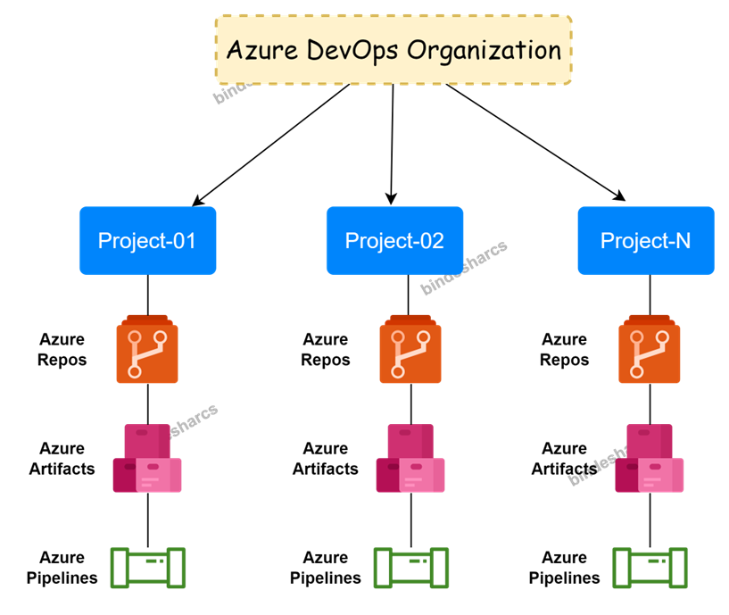

# Azure DevOps Organization Hierarchy

## Azure DevOps Organization

- The Organization is used to connect groups of related projects, and help to scale up your enterprise.
- With an organization, you gain access to Azure DevOps Services, where you can do the following tasks:
  - Collaborate with others to develop applications by using our cloud service.
  - Plan and track your work and code defects and issues.
  - Set up continuous integration and deployment.
  - Integrate with other services by using service hooks.

## Azure DevOps Organization Hierarchy

## Plan your organizationl structure
