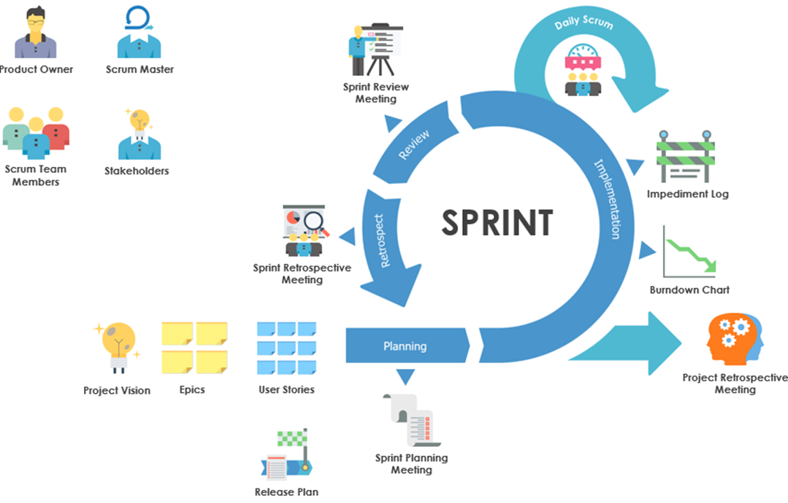
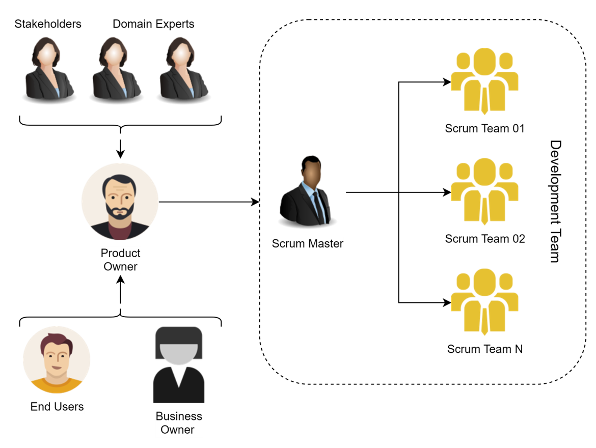
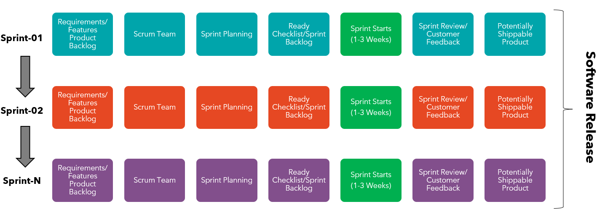
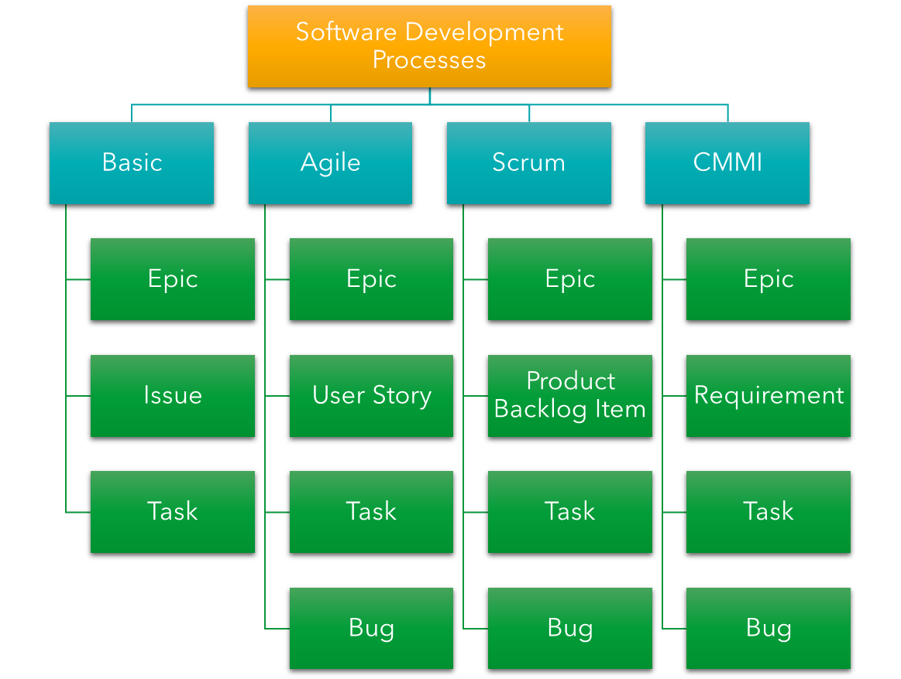

# Project Management and Collaboration

## What is Agile?

- Agile is an iterative approach to project management and software development that help teams deliver value to their customers faster and with fewer overhead.
- Instead of building the whole software in one go, an agile team delivers work in small, but consumable increments.
- Requirements, plans, and results are evaluated continuously so teams have a natural mechanism for responding to change quickly.
  

## Scrum Team Structure

## Agile Software Development

## Introduction to `Azure Boards`

- Azure Boards is a web-based service that enables teams to plan, track, and discuss work across the entire development process, while it supports agile methodologies.
- Azure Boards provides a customizable platform for managing work items, allowing teams to collaborate effectively and streamline their workflow.

## Azure Boards Hub

- **Work items**: Access lists of work items based on specific criteria, such as those assigned to you, ones you follow, and work items you viewed or updated.
- **Boards**: View work items as cards and update their status through drag-and-drop, similar to physical sticky notes on a whiteboard. Use this feature to implement Kanban practices and visualize work flow for a team.
- **Backlogs**: View, plan, order, and organize work items, including using a product backlog to represent your project plan and a portfolio backlog to group work under features and epics.
- **Sprints**: Access your team's filtered view of work items based on a specific sprint or iteration path. Assign work to a sprint using drag-and-drop from the backlog. Interact with a backlog list or card-based Taskboard to implement Scrum practices.
- **Queries**: Generate custom work item lists and perform various tasks, such as triage work, make bulk updates, and view relationships between work items. Queries also allow for creating status and trend charts that can be added to dashboards.
- **Delivery Plans**: Management teams can view deliverables and track dependencies across multiple teams in a calendar view. Delivery plans support tasks such as viewing up to 15 team backlogs, custom portfolio backlogs and epics, and work that spans several iterations. Users can add backlog items to a plan, view rollup progress of features and epics, and dependencies between work items.
- **Analytics views**: Create highly sophisticated Power BI reports, based on Azure Boards data (work items). Access default Analytics views or create a custom view.

## Azure Boards: [Default Processes](https://learn.microsoft.com/en-us/azure/devops/boards/work-items/guidance/choose-process?view=azure-devops&tabs=agile-process)

## Labs

### Lab-01: Demonstrate the working of Azure DevOps `Delivery Plan`

### Lab-02: Demonstrate the working of Azure DevOps `Work Items`

- **Sprint**: Create Sprint (Iteration)
- **Backlog**: Create Backlog items
- **Epic**: Create an Epic
- **User Story**: Creating user story
- **Task**: Adding Task to user story
- **Bug**: Raising Bug

### Lab-03: Demonstrate the working of Azure DevOps `Dashboards`

- Create an Azure DevOps Dashboard
- Pin widgets to a Dashboard
- Viewing Dashboards as another user

### Labs-04: Demonstrate the working of Azure Boards `Queries`
