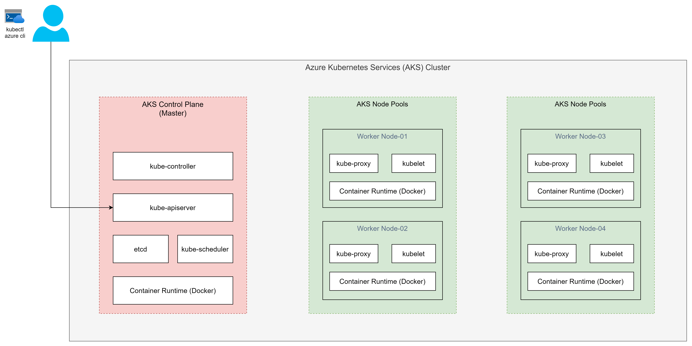

# Microsoft Azure Kubernetes Services (AKS)

## Overview

- Azure Kubernete Services is a fully managed Kubernetes service.
- As on today, AKS is available in 30+ regions and still counting.
- AKS simplifies deploying a managed Kubernetes cluster in Azure by offloading the operational overhead to Azure.
- With AKS, Azure handles critical tasks, like health monitoring and maintenance.

## AKS Architecture

## Create AKS Cluster

You can create an AKS cluster using:

- Azure CLI
- Azure PowerShell
- Azure portal
- IaC, like Azure Resource Manager templates, Bicep, and Terraform.
